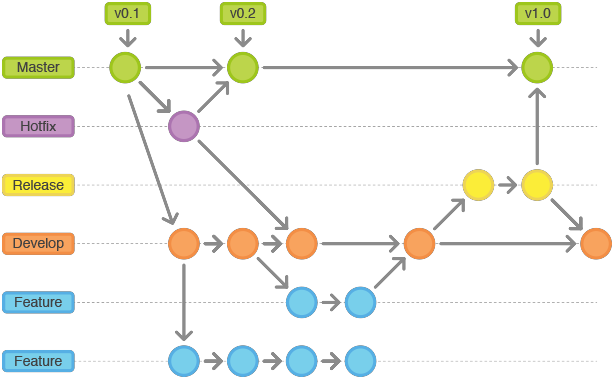

#Ramas o *Branches*

Es la forma para separar la línea actual de desarrollo con respecto
a la principal. Normalmente representan versiones del software que
posteriormente son integradas a la línea principal.

###Comandos Ramas 1

* Ver listado de ramas:

 `git branch`

* Crear una rama:

 `git branch nombre_rama`

* Cambiarnos a una rama:

 `git checkout nombre_rama`

* Crear una rama y moverse en un paso:

 `git checkout -b nombre_rama`

* Comparar ramas:

 `git diff nombre_rama..nombre_rama`
