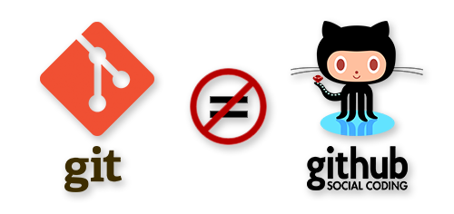

# GitHub no es Git

GitHub es un servicio de alojamiento que ofrece a los desarrolladores repositorios de software usando el sistema de control de versiones, Git.

Existen varios aspectos que hacen que GitHub sea una opción eficiente para el control y gestión de tus proyectos.

Estos son algunos de ellos:

* Permite que puedas compartir tus proyectos de una forma mucho más fácil.

* Te permite colaborar para mejorar los proyectos de otros y a otros mejorar o aportar a los tuyos.

* Ayuda reducir significativamente los errores humanos, a tener un mejor mantenimiento de distintos entornos y a detectar fallos de una forma más rápida y eficiente.

* Es la opción perfecta para poder trabajar en equipo en un mismo proyecto.

# Comandos GitHub I

#### Añadir repositorio remoto:

`git remote add origin url`

#### Ver repositorios remotos:

`git remote -v`

#### Eliminar repositorio remoto:

`git remote rm origin`

#### Añadir cambios del repositorio local al remoto:

`git push -u origin master`

#### Añadir cambios del repositorio remoto al local:

`git pull`
