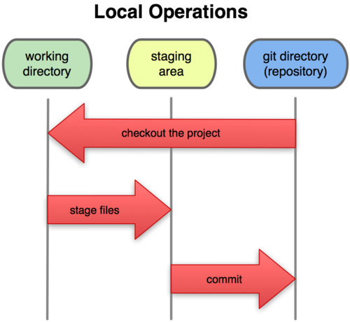
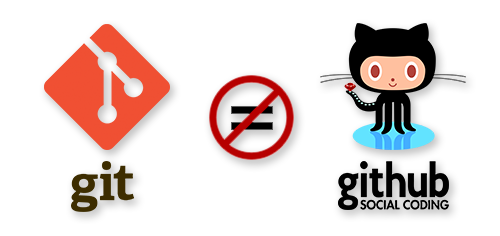

## Qué es git

*Sistema para el control distribuido de versiones
de código. Fundamentalmente permite:*
1. Dar seguimiento a los cambios realizados sobre un archivo

2. Almacenar una copia de los cambios

## Configuración básica

##### Nombre del administrador:
`git config --global user.name "Juan Manuel Álvarez Morales"`

##### Correo electrónico:
`git config --global user.email i62almoj@uco.es`

##### Editor de texto:
`git config --global core.editor "gedit"`

##### Color de la interfaz:
`git config --global color.ui true`

##### Listado de la configuración:
`git config --list`

## Comandos básicos 1

##### Iniciar repositorio en un directorio:
`git init`

##### Agregar cambios al área de staging:
`git add`

##### Validar cambios en el repositorio:
`git commit -m "Mensaje"`

##### Hacer los dos pasos anteriores en uno:
`git commit -am "Mensaje"`

##### Historial de commits:
`git log`

## Comandos básicos 2

##### Ayuda del listado anterior:
`git help log`

##### Listar los 5 commits más recientes:
`git log -n 5`

##### Listar los commits desde una fecha:
`git log --since=2018-09-18`

##### Listar los commits por autor:
`git log --author="Juanma"`

##### Ver cambios en el directorio:
`git status`

## Comandos básicos 3

##### Ver diferencia entre ficheros en el directorio y el repositorio de git:
`git diff`

##### Ver diferencia entre los ficheros en el staging y el repositorio:
`gis diff --staged`

##### Eliminar archivos:
`git rm archivo`

`git commit -m "mensaje"

##### Mover o renombrar archivos:
`git mv antiguo nuevo`

`git commit -m "mensaje"`

## Comandos básicos 4

##### Deshacer cambios con git:
`git checkout --nombre_fichero`

##### Retirar archivos del staging:
`git reset HEAD nombre_fichero`

##### Complementar último commit:
`git commit --amend -m "mensaje`

##### Recuperar versión de un fichero de commit antiguo:
`git checkout <id_commit> -- nombre_archivo'

##### Revertir un commit:
`git revert <id_commit>`

## Comandos básicos 5

##### Listar el contenido del repositorio de git:
`git ls-tree master`

`git ls-tree master^^^`

`git ls-tree master~3`

##### Log en una línea:
`git log --oneline`

##### Log con los tres últimos commit en una línea:
`git log --oneline -3`

###### Para más opciones consultar documentación de git.

## Comandos básicos 6

##### Deshacer múltiples cambios en el repositorio:
`git reset --soft <id_commit>`

`git reset --mixed <id_commit>`

`git reset --hard <id_commit>`

##### Listar archivos que git no controla:
`git clean -n`

##### Eliminar archivos que git no controla:
`git clean -f`

###### Ignorar archivos en el repositorio .gitignore

## Comandos básicos 7

##### Examinar el contenido de un commit
`git show <id>`

##### Comparar un commit con el actual:
`git diff <id> nombre_archivo`

##### Comparar dos commits:
`git diff id..id nombre_archivo`
# Ramas o *Branches*

Es la forma para separar la línea actual de desarrollo con respecto
a la principal. Normalmente representan versiones del software que
posteriormente son integradas a la línea principal.

### Comandos Ramas I

* Ver listado de ramas:

  `git branch`

* Crear una rama:

  `git branch nombre_rama`

* Cambiarnos a una rama:

  `git checkout nombre_rama`

* Crear una rama y moverse en un paso:

  `git checkout -b nombre_rama`

* Comparar ramas:

  `git diff nombre_rama..nombre_rama`

### Comandos Ramas II

* Ver ramas idénticas a la actual:

  `git branch --merged`

* Renombrar ramas:

  `git branch -m nombre_antiguo nombre_nuevo`

* Eliminar ramas:

  ~~~
  git branch -d nombre_rama
  git branch -D nombre_rama
  ~~~

* Integrar ramas a la actual:

  `git merge nombre_rama`

* Resolver conflictos (se suele hacer manualmente):

  `git merge --abort`

### Comandos Ramas III

* Almacenar cambios temporales:

  `git stash save "Mensaje"`

* Listar cambios:

  `git stash list`

* Ver contenido de un cambio temporal:

  `git stash show -p nombre_stash`

* Eliminar un cambio temporal:

  `git stash drop nombre_stash`

* Aplicar cambio del *stash*:

  ~~~
  git stash apply nombre_stash
  git stash pop nombre_stash
  ~~~
# GitHub no es Git

GitHub es un servicio de alojamiento que ofrece a los desarrolladores repositorios de software usando el sistema de control de versiones, Git.

Existen varios aspectos que hacen que GitHub sea una opción eficiente para el control y gestión de tus proyectos.

Estos son algunos de ellos:

* Permite que puedas compartir tus proyectos de una forma mucho más fácil.

* Te permite colaborar para mejorar los proyectos de otros y a otros mejorar o aportar a los tuyos.

* Ayuda reducir significativamente los errores humanos, a tener un mejor mantenimiento de distintos entornos y a detectar fallos de una forma más rápida y eficiente.

* Es la opción perfecta para poder trabajar en equipo en un mismo proyecto.

# Comandos GitHub I

#### Añadir repositorio remoto:

`git remote add origin url`

#### Ver repositorios remotos:

`git remote -v`

#### Eliminar repositorio remoto:

`git remote rm origin`

#### Añadir cambios del repositorio local al remoto:

`git push -u origin master`

#### Añadir cambios del repositorio remoto al local:

`git pull`

# Comandos GitHub II

#### Ver branches remotos:

`git branch -r`

#### Ver todos los branches:

`git branch -a`

#### Clonar un repositorio remoto:

`git clone url`

# Comandos GitHub II

#### Ver branches remotos:

`git branch -r`

#### Ver todos los branches:

`git branch -a`

#### Clonar un repositorio remoto:

`git clone url`

# Operaciones con *branches* remotos:

* **Creación**

 1. Crear branch local.

 2. Hacer cambios en dicho branch.
 3. Hacer commit.
 4. Copiar el branch al repositorio remoto:

 `git push -u origin branch_remoto`

* **Copia:**

 `git chekout -b local remoto`

* **Eliminación:**

 `git push origin --delete branch_remoto`
